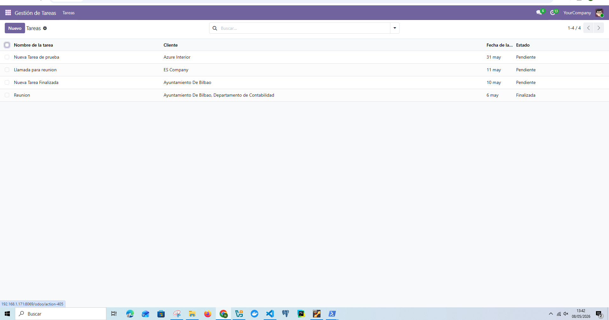
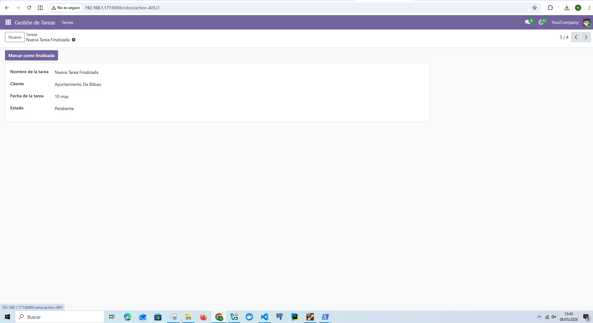
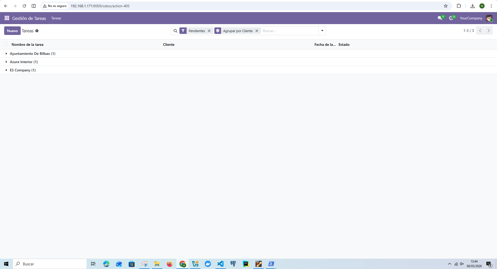
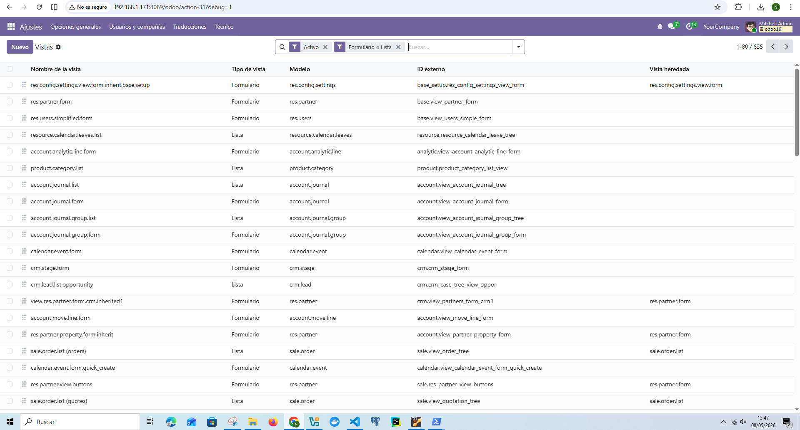

## 1. Crear registros
- Crear varias tareas con diferentes clientes
- Verificar almacenamiento correcto

## 2. Cambiar estado
- Usar botón "Marcar Finalizada"
- Comprobar cambio en BD

## 3. Consultas ORM
- Filtrar tareas pendientes
- Filtrar tareas por cliente

## 4. Validación visual
- Comprobar vista tree
- Comprobar vista form

## 5. Exportación
- Exportar listado a CSV
- Verificar estructura del archivo

